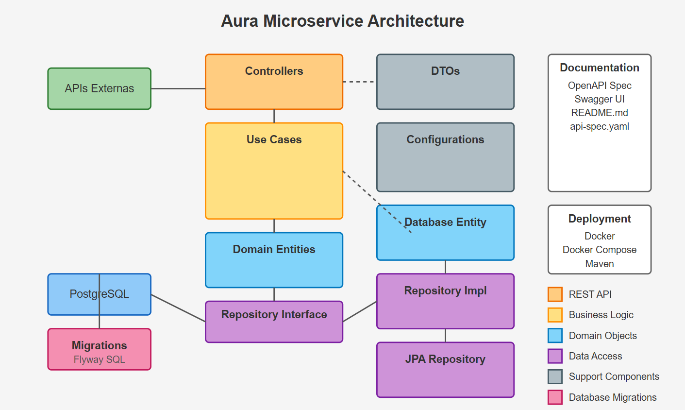

# AURA MS Client

Este microsserviço é parte da arquitetura **AURA MS CLIENT**, fornecendo funcionalidades de gerenciamento de clientes e seus endereços.
É uma aplicação Spring Boot projetada com uma abordagem de arquitetura limpa. Ela gerencia dados de clientes com validação e persistência em um banco de dados PostgreSQL.

## Stack Tecnológica

- Java 21
- Spring Boot 3.4.4
- PostgreSQL
- Flyway (migrações de banco de dados)
- JPA / Hibernate
- JUnit 5 & Mockito (testes)
- Docker & Docker Compose
- Maven

## Estrutura do Projeto

## Arquitetura

O projeto segue um padrão de **Arquitetura Limpa** com clara separação de responsabilidades:

- **DOMAIN**: Contém lógica de negócios e entidades.
- **APPLICATION**: Casos de uso que orquestram operações do domínio.
- **CONFIG**: Configurações e Exceptions.
- **ADAPTERS**: Controladores e repositórios que lidam com comunicação externa.
- **GATEWAY**: Implementações de infraestrutura para persistência.

